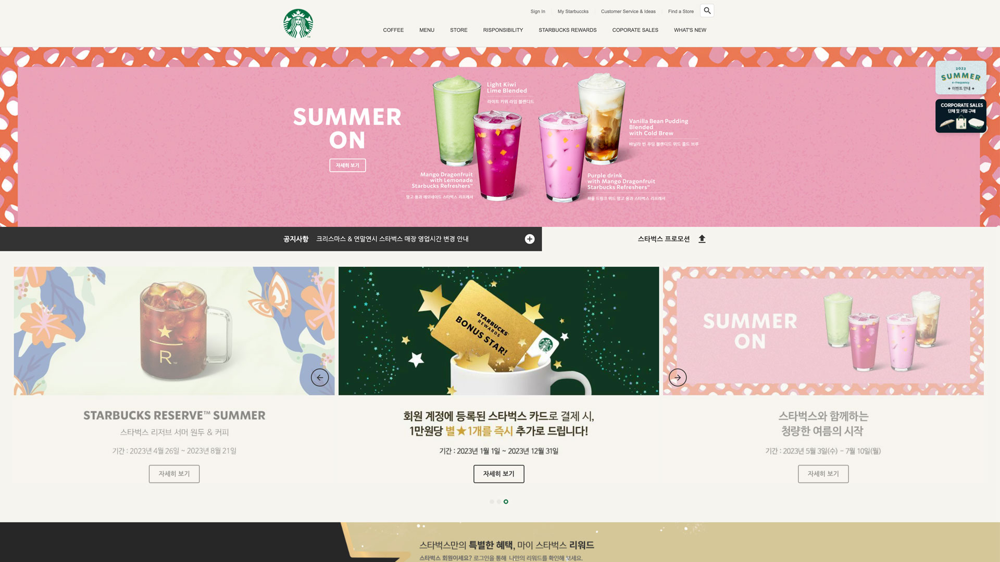

# ☕️ Starbucks

스타벅스 클론코딩 사이트 입니다.  
아래⬇️에 스타벅스 <span style="color:royalblue; font-weight:700;">링크</span>를 눌러 페이지를 확인 해보세요!  

[STARBUCKS](https://kijun-starbucks.netlify.app/)


스타벅스 메인 페이지 클론코딩 사이트 입니다.

<br>
<br>

# 1.Swiper


[Swiper](https://swiperjs.com/)를 사용하여 가속 전환과 여러 기본 동작을 갖춘 슬라이드를 구성하였습니다.

```HTML
<!-- in HEAD -->
<link rel="stylesheet" href="https://unpkg.com/swiper@6.8.4/swiper-bundle.min.css" />
<script src="https://unpkg.com/swiper@6.8.4/swiper-bundle.min.js"></script>

<!-- in BODY -->
<div class="swiper-container">
  <div class="swiper-wrapper">
    <div class="swiper-slide">1</div>
    <div class="swiper-slide">2</div>
    <div class="swiper-slide">3</div>
  </div>
</div>
```

```Javascript
new Swiper(요소, 옵션);
```

```Javascript
new Swiper('.swiper-container', {
  direction: 'vertical', // 수직 슬라이드
  autoplay: true, // 자동 재생 여부
  loop: true // 반복 재생 여부
});
```

<br>
<br>

# 2.Youtube Api


[IFrame Player API](https://developers.google.com/youtube/iframe_api_reference?hl=ko)를 사용해 YouTube 영상을 제어 하였습니다.

```HTML
<!-- in HEAD -->
<script defer src="./js/youtube.js"></script>

<!-- in BODY -->
<div id="player"></div>
```

[플레이어 매개변수(playerVars)](https://developers.google.com/youtube/player_parameters.html?playerVersion=HTML5&hl=ko#Parameters)를 참고

```Javascript
// Youtube IFrame API를 비동기로 로드합니다.
var tag = document.createElement('script');
tag.src = "https://www.youtube.com/iframe_api";
var firstScriptTag = document.getElementsByTagName('script')[0];
firstScriptTag.parentNode.insertBefore(tag, firstScriptTag);

function onYouTubePlayerAPIReady() {
  // <div id="player"></div>
  new YT.Player('player', {
    videoId: 'An6LvWQuj_8', // 재생할 유튜브 영상 ID
    playerVars: {
      autoplay: true, // 자동 재생 유무
      loop: true, // 반복 재생 유무
      playlist: 'An6LvWQuj_8' // 반복 재생할 유튜브 영상 ID 목록
    },
    events: {
      // 영상이 준비되었을 때,
      onReady: function (event) {
        event.target.mute(); // 음소거!
      }
    }
  });
}
```

<br>
<br>

# 3.ScrollMagic


[ScrollMagic](http://scrollmagic.io/docs/)을 활용해 요소들이 지정한 스크롤 위치에 있다면 화면에 보이도록 설정 하였습니다.

```HTML
<script src="https://cdnjs.cloudflare.com/ajax/libs/ScrollMagic/2.0.8/ScrollMagic.min.js"></script>
```
```Javascript
new ScrollMagic
  .Scene({ // 감시할 장면(Scene)을 추가
    triggerElement: spyEl, // 보여짐 여부를 감시할 요소를 지정
    triggerHook: .8 // 화면의 80% 지점에서 보여짐 여부 감시
  })
  .setClassToggle(spyEl, 'show') // 요소가 화면에 보이면 show 클래스 추가
  .addTo(new ScrollMagic.Controller()) // 컨트롤러에 장면을 할당(필수!)
  ```

